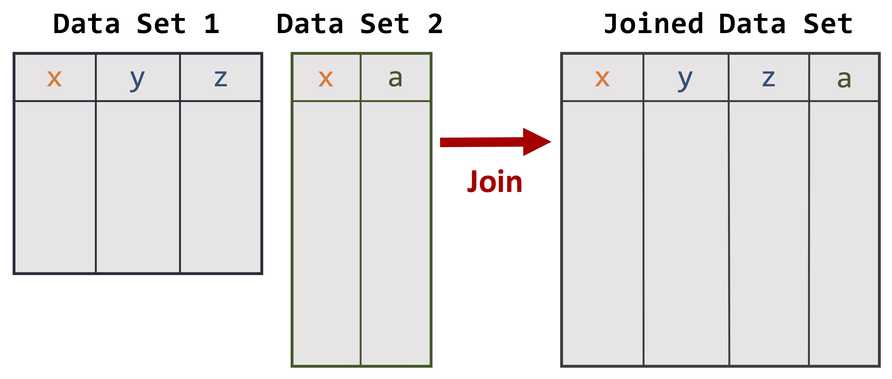
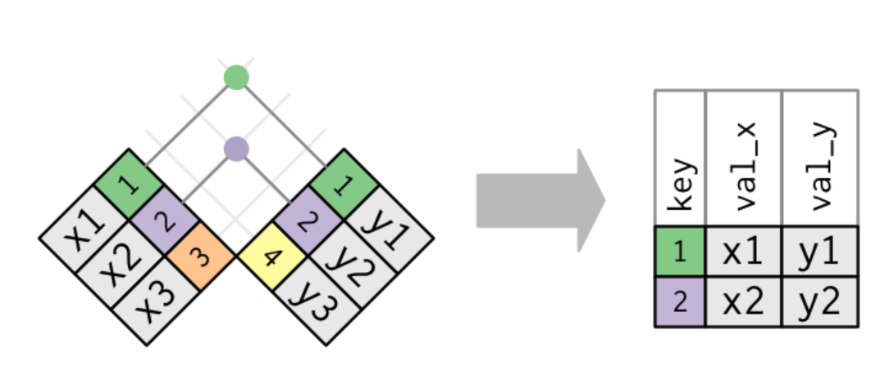
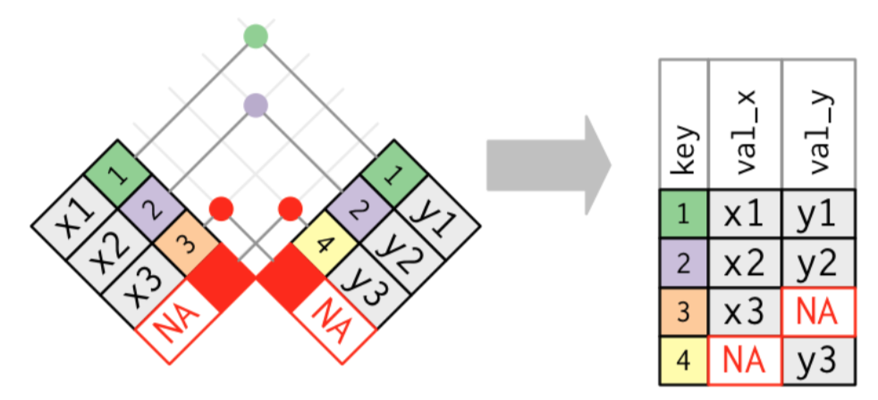
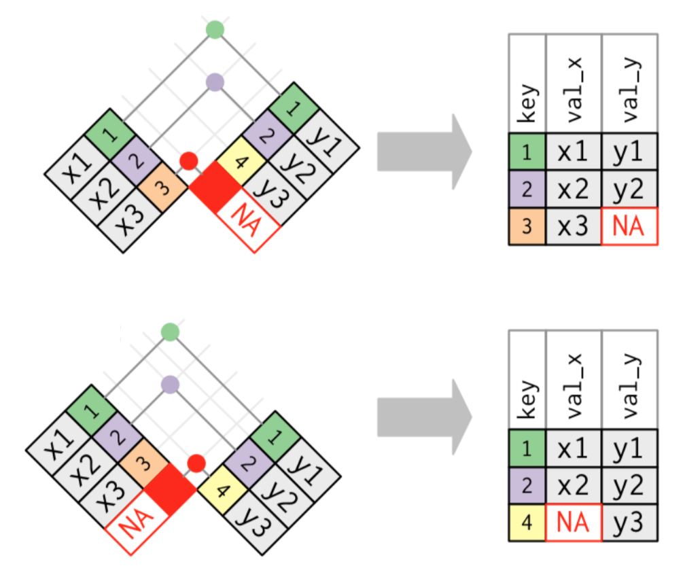

```{r setup, include=FALSE}
options(htmltools.dir.version = FALSE)
```

# What can be done with data...

.large[.huge[.center[
[Tesla Autopilot 2.0](https://www.youtube.com/watch?v=C3DbrYx-SN4)
]]]

---
# Joining Data Sets




---
# Some Vocabulary

.pull-left[
.large[.large[
- .dcoral[**Join (merge)**] = combining two data sets (or *tables*) based on some **primary key(s)**
- .nicegreen[**Primary Key**] = a variable that uniquely identifies observations in a table
]]]

.footnote[
[R For Data Science](http://r4ds.had.co.nz/relational-data.html)
]

--

.pull-right[
.large[.large[
- .bluer[**Foreign Key**] = a variable that uniquely identifies an observation in another table
- .dcoral[**Relation**] = the relationship between a primary key and a foreign key
]]]

---
background-image: url(key_diagram.jpg)
background-position: 50% 85%
background-size: 800px

# Example


---
# Types of Joins

.pull-left[.large[.large[
.dcoral[**Inner Join**] = joining only the observations that are in both tables

.bluer[**Left Join**] = joining all observations in first table but drop those in the second that are not in the first
]]]

--

.pull-right[.large[.large[
.nicegreen[**Right Join**] = joining all observations in second table but drop those in the first that are not in the second

.dcoral[**Full (Outer) Join**] = joining all the observations whether they are in one or both tables
]]]

---
background-image: url(animated-inner-join.gif)
background-position: 50% 60%
background-size: 700px

# Inner Join

.footnote[Thanks to [Garrick Aden-Buie](garrickadenbuie.com) for the gganimate code for these figures!]

---
background-image: url(animated-left-join.gif)
background-position: 50% 60%
background-size: 700px

# Left Join

.footnote[Thanks to [Garrick Aden-Buie](garrickadenbuie.com) for the gganimate code for these figures!]

???
Anything stand out at you compared to the last diagram?

---
background-image: url(animated-right-join.gif)
background-position: 50% 60%
background-size: 700px

# Right Join

.footnote[Thanks to [Garrick Aden-Buie](garrickadenbuie.com) for the gganimate code for these figures!]

---
background-image: url(animated-full-join.gif)
background-position: 50% 60%
background-size: 600px

# Full Join

.footnote[Thanks to [Garrick Aden-Buie](garrickadenbuie.com) for the gganimate code for these figures!]

---
# Quiz!

.pull-left[


]

.pull-right[

]


---
# Quiz!

.huge[
- Explain joining in a sentence or two.
]

--

.huge[
- If you have more individuals in data set 1 than data set 2 and you want to keep all of the observations, what kind of join is best?
]

--

.huge[
- Thought Experiment: What would happen if you tried to join on a foreign key?
]

---
# Answers

.huge[
- Joining is taking two data sets and joining them based on identifiers (keys) or something similar to that.
]

--

.huge[
- Either left join or full join.
]

--

.huge[
- This situation is called duplicate keys. See next slide for an example.
]

---
background-image: url(duplicatekeys_diagram.png)
background-position: 50% 80%
background-size: 800px

# Duplicate Keys

.huge[For `x` this is a foreign key and for `y` it is a primary key. Why is that?]

---
background-image: url(key_diagram.jpg)
background-position: 50% 85%
background-size: 800px

# Let's Join!

---
# Health

```{r, echo=FALSE, warning=FALSE, message=FALSE}
library(tidyverse)
load("data_officeparks/OfficeParks_Tables.rda")

health %>%
  DT::datatable(options = list(pageLength = 4, 
                               autoWidth = TRUE),
                rownames = FALSE)
```

---
# Demographics

```{r, echo=FALSE}
demo %>%
  DT::datatable(options = list(pageLength = 4),
                rownames = FALSE)
```

---
# Show Info

```{r, echo=FALSE}
show %>%
  DT::datatable(options = list(pageLength = 4, 
                               dom = "t"),
                rownames = FALSE)
```

---
# Joining in `R`

.huge[
We will use the .dcoral[`tidyverse`] package:
]

.large[.large[
1. .nicegreen[`inner_join`].dcoral[`(`]`data1, data2`.dcoral[`)`]

2. .nicegreen[`left_join`].dcoral[`(`]`data1, data2`.dcoral[`)`]

3. .nicegreen[`right_join`].dcoral[`(`]`data1, data2`.dcoral[`)`]

4. .nicegreen[`full_join`].dcoral[`(`]`data1, data2`.dcoral[`)`]
]]

---
background-image: url(key_diagram.jpg)
background-position: 95% 90%
background-size: 250px

# Inner Join

```{r, echo=TRUE, eval=FALSE}
inner_join(show, demo, by = "show")
```

```{r, eval=TRUE, echo=FALSE, warning=FALSE, message=FALSE}
inner_join(show, demo, by = "show") %>%
  DT::datatable(options = list(pageLength = 4, 
                               dom = "t"),
                rownames = FALSE)
```

---
background-image: url(key_diagram.jpg)
background-position: 95% 90%
background-size: 250px

# Left and Right Joins

### Left

```{r, echo=TRUE, eval=FALSE}
left_join(show, demo, by = "show")
```

### Right

```{r, echo=TRUE, eval=FALSE}
right_join(show, demo, by = "show")
```

---
background-image: url(key_diagram.jpg)
background-position: 95% 90%
background-size: 250px

# Full Joins

```{r, echo=TRUE, eval=FALSE}
full_join(show, demo, by = "show")
```

```{r, eval=TRUE, echo=FALSE, warning=FALSE, message=FALSE}
full_join(show, demo, by = "show") %>%
  DT::datatable(options = list(pageLength = 4, 
                               dom = "t"),
                rownames = FALSE)
```

---
background-image: url(key_diagram.jpg)
background-position: 95% 90%
background-size: 300px

# Join Health and Demographics

.huge[
Notable aspects of these sets:
]

.large[.large[
- Health is in long form (two time points)

- Demographics and health have multiple overlapping primary keys (`nam` and `show`)
]]

---
# Join Health and Demographics

```{r, echo=TRUE, eval=FALSE}
full_join(health, demo, by = c("nam", "show")) ## or inner_, left_,, or right_
```

```{r, eval=TRUE, echo=FALSE, warning=FALSE, message=FALSE}
full_join(health, demo, by = c("nam", "show")) %>%
  DT::datatable(options = list(pageLength = 4),
                rownames = FALSE)
```

---
# What if we .dcoral[forgot] one of the .nicegreen[keys]?

```{r, echo=TRUE, eval=FALSE}
full_join(health, demo, by = "nam")
```

.large[.large[
This provides 80 rows (not the correct 76)
]]

--

<br>

```{r, echo=TRUE, eval=FALSE}
full_join(health, demo, by = "show")
```

.large[.large[
This provides 1,480 rows (not the correct 76)
]]

--

<br>

.center[.large[.large[.dcoral[ Why might this happen? ]]]]

---
background-image: url(fig_bad_join.jpg)
background-position: 50% 85%
background-size: 1000px

# .nicegreen[Unique] Identifiers

.huge[If we don't have unique identifiers the data can blow up]


---
# Common Errors...

.huge[
1. Understand your data (both primary and foreign keys, missing values)

2. Trying to join when should be "binding"
]

---
# What About Missing?

.huge[
Notes:

1. If .dcoral[key] (primary or foreign) is missing, those cannot be joined with the correct data (it will keep those in `full_join()`)

2. Other missing values are carried into the joined set
]

---
# .dcoral[Bind], Instead of Join

.huge[
What if we have two versions of the demographics table

- One that contains info on "Parks and Rec"
- The other on "The Office"

.bluer[Do we have keys we can join on?]
]

--

.huge[
Nope...
]

---
background-image: url(binding_diagram.jpg)
background-position: 50% 90%
background-size: 600px

# .dcoral[Bind], Instead of Join

```{r, eval=FALSE}
rbind(office_health, parks_health)
```


---
# Awesome Resource

.huge[
[R For Data Science by Garrett Grolemund and Hadley Wickham](http://r4ds.had.co.nz/relational-data.html)
]

---
# Now Can Join Like a Cool Kid


<div style="width:100%;height:0;padding-bottom:75%;position:relative;"><iframe src="https://giphy.com/embed/3o6nUP7jsZCYziNxlK" width="60%" height="60%" style="position:absolute" frameBorder="0" class="giphy-embed" allowFullScreen></iframe></div><p><a href="https://giphy.com/gifs/heyarnold-nicksplat-3o6nUP7jsZCYziNxlK">via GIPHY</a></p>


